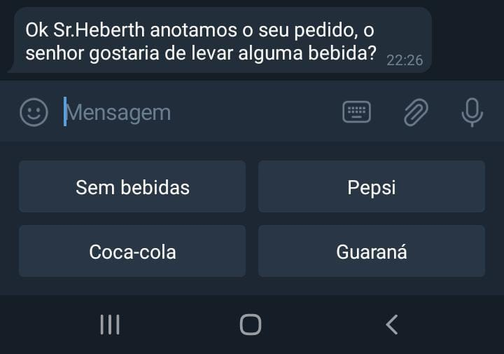

# FUNCIONAMENTO DO BOT 

1. Primeiramente, deve-se baixar o aplicativo Telegram pela loja principal do seu dispositivo mobile ou baixar pelo site oficial do Telegram caso esteja usando um computador ou notebook (também podendo usar versão web): **<https://web.telegram.org/#/login/>**. 

2. Após baixar, crie uma conta utilizando um número de telefone válido; 

3. Na tela inicial do Telegram, utilize a barra de pesquisa para encontrar o bot com o nome de **“PizzariaSossuer”**; 

4. Aperte em “Começar” para inicializar o bot e ele abrirá um menu de opções para o usuário: 

5. Opção cardápio: 

6. Opção Fazer_Pedido: 

7. Colocar as informações para registrar no Banco de dados: (Nota-se que para o Bot entender a mensagem deverá ser colocado “Meu pedido é” antes do pedido e das informações): 

* Opções de bebidas junto com a parte de pedidos: 

8. Opção de “Mais_informações”: 

